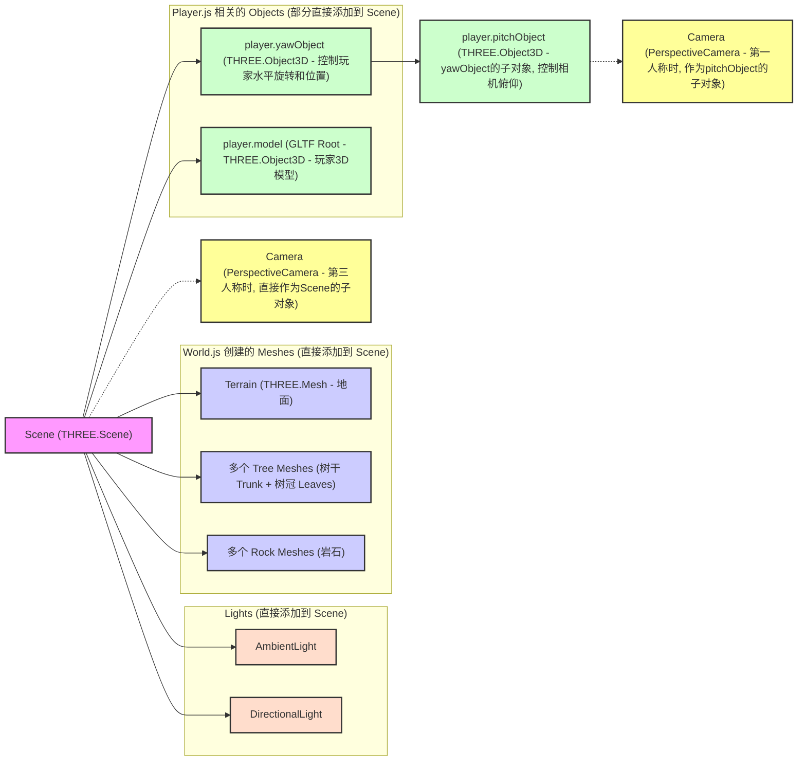

# Three.js 开放世界游戏原型

这是一个使用Three.js构建的开放世界游戏原型，专为初学者设计。项目包含基本的地形生成、玩家控制、碰撞系统和光照效果，适合想要入门3D游戏开发但没有深厚3D知识背景的新手学习。

## 学习价值

如果你是游戏开发新手，本项目可以帮助你学习以下内容：

- 3D游戏的基本结构和组件
- 如何使用Three.js创建3D场景
- 第一人称控制器的实现原理
- 基本的物理和碰撞系统
- 程序化地形生成
- 3D对象的创建和管理
- 游戏循环和状态更新

## 功能特性

- 基于噪声函数的程序化地形生成
- 第一人称相机控制系统
- 完整的物理和碰撞系统
  - 与地形的碰撞检测
  - 与环境物体（树木、岩石）的碰撞检测
  - 能够站立在物体上方
- 树木和岩石等环境元素
- 日光和环境光照系统
- 站立、下蹲和跳跃功能
- 加载进度显示和调试工具

## 项目结构

```
/
├── src/                    # 源代码目录
│   ├── main.js             # 主入口文件，初始化场景和游戏循环
│   ├── Player.js           # 玩家类，处理输入和物理
│   ├── World.js            # 世界类，处理地形和物体生成
│   └── utils/              # 工具函数目录
│       ├── debug.js        # 调试工具类
│       └── loadingManager.js # 资源加载管理器
├── index.html              # HTML入口文件
└── package.json            # 项目依赖配置
```

## 核心组件说明

### 1. 主入口 (main.js)

主入口文件负责初始化Three.js场景、相机、渲染器和灯光。它还设置了游戏循环，这是游戏运行的心脏。

游戏循环的主要任务：
- 更新玩家位置和状态
- 更新世界中的物体
- 处理用户输入
- 渲染场景

### 2. 玩家控制 (Player.js)

玩家控制系统实现了第一人称视角的移动和交互，包括：
- WASD/方向键移动
- 鼠标视角控制
- 跳跃和下蹲功能
- 与环境的碰撞检测

玩家物理系统模拟了：
- 重力和跳跃
- 地面摩擦
- 与物体的碰撞和反弹

### 3. 世界生成 (World.js)

世界生成系统负责创建游戏环境，包括：
- 使用Simplex噪声函数生成自然地形
- 放置树木和岩石等环境物体
- 管理碰撞对象列表
- 创建天空和环境效果

### 4. 工具类

- **debug.js**: 提供游戏状态可视化，帮助开发和调试
- **loadingManager.js**: 管理资源加载过程，显示加载进度

## 游戏运行机制

### 初始化流程

1. 创建Three.js场景、相机和渲染器
2. 设置光照系统（环境光和方向光）
3. 初始化世界并生成地形和物体
4. 创建玩家并设置控制器
5. 启动游戏循环

### 游戏循环

游戏每帧执行以下操作：
1. 计算时间增量（delta）
2. 处理玩家输入并更新位置
3. 检测并处理碰撞
4. 更新世界状态
5. 渲染场景
6. 更新调试信息（如果开启）

## 关键代码解析

### 场景设置

```javascript
// 创建场景
const scene = new THREE.Scene();
scene.background = new THREE.Color(0x87ceeb); // 天空蓝

// 创建相机
const camera = new THREE.PerspectiveCamera(75, window.innerWidth / window.innerHeight, 0.1, 1000);

// 创建渲染器
const renderer = new THREE.WebGLRenderer({ antialias: true });
renderer.setSize(window.innerWidth, window.innerHeight);
renderer.shadowMap.enabled = true;
document.body.appendChild(renderer.domElement);
```

### 地形生成

```javascript
// 使用噪声函数生成高度
const height = 
    this.noise.noise(nx * 1, nz * 1) * 0.5 + 
    this.noise.noise(nx * 2, nz * 2) * 0.3 +
    this.noise.noise(nx * 4, nz * 4) * 0.2;
```

### 玩家移动

```javascript
// 计算移动方向
this.direction.set(0, 0, 0);
if (this.keys.forward) this.direction.z = -1;
if (this.keys.backward) this.direction.z = 1;
if (this.keys.left) this.direction.x = -1;
if (this.keys.right) this.direction.x = 1;

// 应用相机朝向
const rotationMatrix = new THREE.Matrix4();
rotationMatrix.makeRotationY(this.yawObject.rotation.y);
this.direction.applyMatrix4(rotationMatrix);
```

### 碰撞检测

```javascript
// 检查碰撞
const minDistance = this.radius + collisionRadius;
if (distance < minDistance) {
    // 计算推力方向
    const pushDirection = new THREE.Vector2()
        .subVectors(playerPosition, objectPosition)
        .normalize()
        .multiplyScalar(minDistance - distance);
    
    // 应用推力
    this.position.x += pushDirection.x;
    this.position.z += pushDirection.y;
}
```

## 运行项目

1. 克隆项目
```
git clone <项目地址>
cd threejs-open-world
```

2. 安装依赖
```
npm install
```

3. 启动开发服务器
```
npm run dev
```

4. 在浏览器中打开 http://localhost:5173

## 控制说明

- WASD或方向键 - 移动
- 鼠标 - 视角控制
- 空格键 - 跳跃（可以跳到岩石和树木上面）
- Shift键 - 下蹲
- 点击游戏窗口 - 锁定鼠标指针（按ESC解除锁定）
- Ctrl+D - 切换调试信息显示
- H键 - 切换游戏控制提示显示

## 相机控制系统

本项目实现了一个层次化的第一人称相机控制系统，由三个主要部分组成：

### 对象层次结构

1. **yawObject（偏航对象）**：
   - 最顶层对象，控制左右旋转（绕Y轴）
   - 相当于玩家的整个身体
   - 位置等同于玩家在世界中的位置

2. **pitchObject（俯仰对象）**：
   - yawObject的子对象，控制上下旋转（绕X轴）
   - 相当于玩家的头部
   - Y轴位置设为2，模拟头部高度

3. **camera（相机）**：
   - pitchObject的子对象
   - 相当于玩家的眼睛
   - 位置设为原点(0,0,0)，位于pitchObject中心

### 运作原理

- **左右看（水平旋转）**：
  旋转yawObject的Y轴，整个系统（包括相机）跟随旋转
  
- **上下看（垂直旋转）**：
  旋转pitchObject的X轴，垂直视角受限于-90°到90°，防止过度旋转
  
- **移动**：
  通过WASD控制，移动方向与相机朝向同步，实现自然的第一人称控制

## 碰撞系统

本项目实现了一个多层次的碰撞检测系统，用于处理玩家与环境之间的物理交互：

### 碰撞检测类型

1. **地形碰撞**：
   - 使用地形高度图进行精确的高度检测
   - 确保玩家不会穿透地面
   - 支持不同地形高度的自然过渡

2. **环境物体碰撞**：
   - 基于简单的圆柱体碰撞模型
   - 为不同类型的物体（树木、岩石）设置不同的碰撞半径
   - 当发生侧向碰撞时，施加推力将玩家推开

3. **物体站立功能**：
   - 允许玩家跳跃到环境物体上方
   - 为不同物体类型计算准确的顶部高度
   - 实现与地面类似的站立体验

### 碰撞处理流程

1. **收集可碰撞对象**：
   - 世界类（World）生成并维护可碰撞物体列表
   - 包含物体类型、位置、尺寸等碰撞相关参数

2. **检测优先级**：
   - 首先检查玩家是否站在物体上方
   - 然后检查玩家是否接触地面
   - 最后检查是否与物体发生侧向碰撞

3. **碰撞响应**：
   - 对垂直碰撞：调整高度并停止下落
   - 对水平碰撞：计算推力方向，防止穿透

## 对新手的学习建议

1. **浏览代码顺序**：先查看main.js，了解整体结构，然后深入Player.js和World.js

2. **动手尝试**：
   - 调整地形生成参数，查看效果变化
   - 修改玩家移动速度和跳跃高度
   - 添加新的环境物体

3. **渐进式学习**：
   - 先理解场景、相机和渲染器的基本概念
   - 然后学习如何创建和操作3D对象
   - 最后深入碰撞检测和物理系统

4. **实用改进项目**：
   - 添加简单的UI（如生命值、计分器）
   - 增加物品收集功能
   - 实现简单的敌人AI

## 技术栈

- Three.js - 3D图形库
- JavaScript - 编程语言
- Vite - 构建工具和开发服务器

## 未来计划

- 添加更多环境变化（如白天/黑夜循环）
- 改进地形生成算法
- 添加水体和其他景观特性
- 添加更多互动元素
- 优化性能和加载时间
- 增强碰撞系统，支持更多复杂形状
- 添加不同表面的特殊效果（如滑动、弹跳等） 


# 对象相对关系


## 持有关系

>场景中有哪些对象，持有关系是什么样的


场景中的核心是 `THREE.Scene` 对象，它作为所有其他可见对象的根容器。各种元素如光照、几何体（地形、树木、岩石）以及玩家的表示都直接或间接地被添加到这个场景中。

以下是场景中主要对象及其关系的 Mermaid 图表示：



**主要对象的解释和持有关系：**

1.  **`MainScene (THREE.Scene)`**:
    *   这是所有3D对象的根容器。所有你看到的东西最终都存在于这个场景对象中。

2.  **`LightsInScene` (灯光)**:
    *   `AmbientLight`: 提供均匀的环境光，照亮场景中的所有物体。直接添加到 `MainScene`。
    *   `DirectionalLight`: 模拟平行光源（如太阳光），可以产生阴影。直接添加到 `MainScene`。

3.  **`WorldMeshesInScene` (由 `World.js` 创建的物体)**:
    *   这些对象由 `World.js` 类实例化，并逐个添加到 `MainScene`中。
    *   `Terrain (THREE.Mesh)`: 代表游戏世界的地面，是一个单独的网格对象。
    *   `Trees (多个 Tree Meshes)`: 场景中有多棵树。每棵树通常由两部分组成：一个代表树干的 `Mesh` 和一个代表树冠/叶子的 `Mesh`。这些独立的 `Mesh` 对象都直接添加到 `MainScene`。
    *   `Rocks (多个 Rock Meshes)`: 场景中的岩石，每个岩石是一个单独的 `Mesh` 对象，直接添加到 `MainScene`。

4.  **`PlayerObjectsInScene` (与 `Player.js` 相关的对象)**:
    *   `player.yawObject (THREE.Object3D)`: 这是一个空的 `THREE.Object3D`，用于控制玩家的水平旋转（左右看）和在世界中的位置。这个对象被添加到 `MainScene`。玩家的实际移动是通过改变这个对象的位置来实现的。
    *   `player.model (GLTF Root - THREE.Object3D)`: 这是玩家的角色3D模型，通过GLTFLoader加载。模型本身（通常是GLTF场景的根节点，也是一个`THREE.Object3D`）被直接添加到 `MainScene`。它在第三人称视角下可见，并会跟随 `player.yawObject` 的位置。
    *   `player.pitchObject (THREE.Object3D)`: 这是 `player.yawObject` 的一个子对象。它用于控制相机的垂直旋转（上下看或俯仰）。

5.  **`Camera (PerspectiveCamera)`**:
    *   场景中只有一个相机实例，但它在场景图中的父对象会根据当前的视图模式（第一人称或第三人称）而改变：
        *   **第一人称模式 (`CameraFP`)**: 相机是 `player.pitchObject` 的子对象。这样，相机的朝向就会随着 `yawObject`（左右）和 `pitchObject`（上下）的旋转而改变，模拟玩家的视线。
        *   **第三人称模式 (`CameraTP`)**: 相机从 `player.pitchObject` 中移除，并直接成为 `MainScene` 的子对象。它的位置和朝向会基于玩家的位置动态计算，以提供一个越肩或跟随的视角。

总结来说，`World.js` 和 `Player.js` 更像是管理器类，它们负责创建和逻辑控制各自相关的 `THREE.Object3D` 实例，而这些实例（如地形、树木、玩家模型、玩家的旋转控制对象）最终都会被添加到主 `THREE.Scene` 中进行渲染。相机的父子关系则比较特殊，会根据游戏视角动态调整。


## 相对位置

相对位置关系涉及到 Three.js 中场景图（Scene Graph）和对象变换（Transformations）的核心概念。

在 Three.js 中，几乎所有可以被放置在场景中的东西（如 `Mesh`, `Light`, `Camera`, `Group`, 甚至是空的 `Object3D`）都继承自 `THREE.Object3D`。`Object3D` 对象有自己的局部坐标系，并且可以通过 `position`, `rotation` (或 `quaternion`), 和 `scale` 属性来定义其相对于其父对象的位置、旋转和缩放。

如果一个对象是另一个对象的子对象，那么子对象的最终世界变换（World Transform）是其局部变换（Local Transform）与其父对象的世界变换相乘的结果。这意味着父对象的移动、旋转或缩放会影响其所有子对象。

让我们结合项目中的对象来具体说明：

1.  **`player.yawObject` (玩家偏航对象 - 控制左右看和世界位置)**
    *   **相对谁？** 直接相对于 `MainScene` 的原点 (0,0,0)。
    *   **如何影响其他？** `player.yawObject` 的 `position` 属性定义了玩家在世界中的**绝对位置**。它的 `rotation.y` 决定了玩家面朝的水平方向。
    *   它的子对象 (`player.pitchObject`) 会继承这个位置和Y轴旋转。

2.  **`player.pitchObject` (玩家俯仰对象 - 控制上下看)**
    *   **相对谁？** 相对其父对象 `player.yawObject`。
    *   `player.pitchObject.position.y` (即 `this.eyeOffset` 或 `this.crouchEyeOffset`) 定义了相机（眼睛）相对于玩家脚底的高度。这个 Y 值是在 `player.yawObject` 的局部坐标系中定义的。
    *   `player.pitchObject.rotation.x` 控制了玩家视角的垂直方向（向上或向下看）。这个旋转是相对于 `player.yawObject` 的方向的。
    *   因此，`player.pitchObject` 的世界位置和方向会受到 `player.yawObject` 的影响。

3.  **`camera` (相机)**
    *   **第一人称模式**:
        *   **相对谁？** 相对其父对象 `player.pitchObject`。
        *   相机通常放置在 `player.pitchObject` 的原点 (`camera.position.set(0,0,0)`)，因为 `player.pitchObject` 本身的位置已经代表了眼睛的高度。
        *   相机的世界位置和朝向完全由 `player.yawObject` 和 `player.pitchObject` 控制。你通过鼠标移动改变 `yawObject.rotation.y` 和 `pitchObject.rotation.x`，相机就跟着动。
    *   **第三人称模式**:
        *   **相对谁？** 直接相对 `MainScene`。
        *   在这种模式下，`camera.position` 和 `camera.lookAt()` 会在 `animate` 函数中每一帧根据 `player.position` (实际上是 `player.yawObject.position`) 和 `player.yawObject.rotation.y` 来动态计算。相机的位置通常是玩家位置加上一个基于玩家朝向和 `thirdPersonDistance` 的偏移量。

4.  **`player.model` (玩家3D模型)**
    *   **相对谁？** 直接相对 `MainScene`。
    *   它的 `position` 被设置为与 `player.position` (即 `player.yawObject.position`) 同步，但会进行Y轴调整以确保模型的脚部接触地面 (`this.model.position.y = this.position.y - this.height`)。
    *   在第三人称模式下，`player.model.rotation.y` 会根据玩家的移动方向进行平滑插值更新，使其朝向移动的方向。这个旋转是独立于 `player.yawObject.rotation.y` 的（`yawObject` 的旋转主要用于第一人称相机控制）。

5.  **`Terrain`, `Trees`, `Rocks` (世界物体)**
    *   **相对谁？** 直接相对 `MainScene` 的原点。
    *   这些对象在 `World.js` 中创建时，它们的 `position` (例如 `trunk.position.set(x, height + 1, z)`) 是直接在世界坐标系中设置的。
    *   它们的位置是固定的，除非你有代码去动态改变它们。

6.  **`AmbientLight`, `DirectionalLight` (灯光)**
    *   **相对谁？** 直接相对 `MainScene`。
    *   `AmbientLight` 通常没有位置概念，它均匀影响整个场景。
    *   `DirectionalLight` 的 `position` (`directionalLight.position.set(50, 200, 100)`) 是在世界坐标系中设置的，它定义了光线的方向（从这个位置射向场景原点）。虽然设置了 `position`，但对于平行光而言，更重要的是这个位置向量所代表的方向。

**总结相对位置的关键点：**

*   **父子关系决定了变换的继承**：子对象的位置、旋转、缩放都是在其父对象的坐标系下定义的，并会受到父对象变换的影响。
*   **`player.yawObject` 是玩家在世界中的锚点**：它的世界位置就是玩家的世界位置。
*   **`player.pitchObject` 和第一人称相机是相对于 `player.yawObject` 的**：这使得相机能自然地跟随玩家的移动和朝向。
*   **世界环境物体（地形、树、岩石）和灯光通常直接放置在世界坐标中**：它们的 `position` 是相对于场景原点的。
*   **玩家模型 (`player.model`) 在第三人称下其位置跟随 `player.yawObject`，但其自身的旋转可以独立控制**，以匹配移动方向。

这种层级结构使得复杂的运动和相对定位变得更容易管理。例如，你只需要移动 `player.yawObject`，它的子对象（如 `pitchObject` 和第一人称下的相机）就会自动跟着移动。


### 表格整理


| 对象                     | 相对谁？ (父对象或主要参考对象) | 关键的相对位置/朝向特性                                      |
| :----------------------- | :------------------------------ | :----------------------------------------------------------- |
| **`MainScene`**          | *场景根，无父对象*              | 所有其他对象最终都直接或间接是它的子对象。定义了世界的原点 (0,0,0) 和全局坐标系。 |
| **`player.yawObject`**   | `MainScene`                     | -   `position`: 玩家在世界中的**绝对位置**。<br>-   `rotation.y`: 玩家的水平朝向（左右看），在第一人称下直接影响相机，在第三人称下影响相机和模型的理想朝向。 |
| **`player.pitchObject`** | `player.yawObject`              | -   `position.y`: ( `eyeOffset` / `crouchEyeOffset` ) 相机（眼睛）相对于玩家脚底的高度，是在 `yawObject` 的局部坐标系中定义的。<br>-   `rotation.x`: 玩家视角的垂直朝向（上下看），在第一人称下直接影响相机。 |
| **`camera` (第一人称)**  | `player.pitchObject`            | -   `position`: 通常为 (0,0,0) 相对于 `pitchObject`，因为 `pitchObject` 已经代表了眼睛位置。<br>-   世界位置和朝向完全由 `yawObject` 和 `pitchObject` 的变换决定。 |
| **`camera` (第三人称)**  | `MainScene`                     | -   `position`: 动态计算，基于 `player.position` (`yawObject.position`)、`player.yawObject.rotation.y` 和 `thirdPersonDistance` 的偏移。<br>-   `lookAt()`: 动态设置，通常看向玩家位置或玩家上方一点。 |
| **`player.model`**       | `MainScene`                     | -   `position`: 与 `player.position` (`yawObject.position`) 同步，但Y轴会调整以使模型脚踩地面 (`this.position.y - this.height`)。<br>-   `rotation.y`: (第三人称时) 根据玩家移动方向平滑更新，使其朝向移动方向。这个旋转独立于 `yawObject` 的Y轴旋转。 |
| **`Terrain` (地面)**     | `MainScene`                     | -   `position`: 通常在世界坐标 (0, Y, 0) 创建，Y值可能因地形生成而异或固定。其几何顶点定义了世界的高度。 |
| **`Trees` (树木)**       | `MainScene`                     | -   每棵树的 `trunk` (树干) 和 `leaves` (树冠) 的 `position` 都是在世界坐标系中设置的，通常基于地形高度。 |
| **`Rocks` (岩石)**       | `MainScene`                     | -   每块岩石的 `mesh` 的 `position` 是在世界坐标系中设置的，通常基于地形高度。 |
| **`AmbientLight`**       | `MainScene`                     | -   通常没有特定的位置概念，均匀影响整个场景。               |
| **`DirectionalLight`**   | `MainScene`                     | -   `position`: 在世界坐标系中设置 (例如 `(50, 200, 100)`)。这个位置向量定义了平行光线的**方向**（从该位置射向场景原点）。其 `target` 默认为场景原点，也可以明确设置。 |


## object3d的rotation

我们来详细解释一下 `THREE.Object3D` 中 `rotation.x` 和 `rotation.y` 的旋转方向，以及 `rotation.z` 的情况。

在 Three.js 中，默认的坐标系是**右手坐标系**：
*   **X 轴正方向**: 指向右边。
*   **Y 轴正方向**: 指向上方。
*   **Z 轴正方向**: 指向屏幕外（朝向观察者）。

当讨论欧拉角 `rotation` (`object.rotation.x`, `object.rotation.y`, `object.rotation.z`) 时，正向旋转遵循**右手定则**：伸出右手，让拇指指向旋转轴的正方向，那么四指弯曲的方向就是正角度的旋转方向。

让我们具体看一下：

1.  **`rotation.x` (通常用于俯仰 - Pitch)**:
    *   **旋转轴**: X 轴。
    *   **正向旋转**: 当你从 X 轴正方向（右边）看向原点时，正角度的旋转是**逆时针**的。
        *   这意味着如果一个物体默认朝向 Z 轴负方向（屏幕内），增加 `rotation.x` 会使其**头部向上抬起**（物体的前端向上方 Y+ 倾斜）。
    *   **在你的代码中 (`player.pitchObject.rotation.x`)**:
        *   `this.pitchObject.rotation.x -= event.movementY * this.mouseSensitivity;`
        *   鼠标向上移动时，`event.movementY` 为负值，所以 `this.pitchObject.rotation.x` 会**增加**。
        *   因此，`rotation.x` 的正向确实对应于**向上看**。

2.  **`rotation.y` (通常用于偏航 - Yaw)**:
    *   **旋转轴**: Y 轴。
    *   **正向旋转**: 当你从 Y 轴正方向（上方）看向原点时，正角度的旋转是**逆时针**的。
        *   这意味着如果一个物体默认朝向 Z 轴负方向，增加 `rotation.y` 会使其**向左转头**（物体的前端向左方 X- 旋转）。
    *   **在你的代码中 (`player.yawObject.rotation.y`)**:
        *   `this.yawObject.rotation.y -= event.movementX * this.mouseSensitivity;`
        *   鼠标向右移动时，`event.movementX` 为正值，所以 `this.yawObject.rotation.y` 会**减小**。
        *   这意味着，为了实现向右看，你需要减小 `rotation.y`。反过来说，`rotation.y` 的正向对应于**向左看**。
        *   所以你说的“`rotation.y` 的正向分别是朝右”是不准确的，实际上 `rotation.y` 的正向是**朝左**旋转。

3.  **`rotation.z` (通常用于翻滚 - Roll)**:
    *   **旋转轴**: Z 轴。
    *   **正向旋转**: 当你从 Z 轴正方向（屏幕外）看向原点时，正角度的旋转是**逆时针**的。
        *   这意味着如果一个物体默认朝向 Z 轴负方向，增加 `rotation.z` 会使其**向左翻滚**（物体的顶部向左方 X- 倾斜）。
    *   **在你的 `Player.js` 中**: 对于 `player.yawObject` 和 `player.pitchObject`，你**没有使用 `rotation.z`**。
        *   `player.yawObject` (控制左右看) 只修改了 `rotation.y`。
        *   `player.pitchObject` (控制上下看) 只修改了 `rotation.x`。
        *   在典型的第一人称或第三人称角色控制器中，通常不需要 Z 轴的旋转（翻滚），所以不使用 `rotation.z` 是非常正常的。除非你在做一个飞行模拟器或者有特殊的歪头动作。

**总结一下你的问题：**

*   **`player.pitchObject.rotation.x` 的正向是朝上的吗？**
    *   是的，可以这么理解。增加 `rotation.x` 会使视角向上。
*   **`player.yawObject.rotation.y` 的正向是朝右的吗？**
    *   不完全是。`rotation.y` 的正值是使视角**朝左**旋转。在你的代码中，为了实现向右看，你是在减小 `rotation.y` 的值。
*   **是不是没有 `rotation.z`？**
    *   对于 `player.yawObject` 和 `player.pitchObject` 的视角控制，你的代码中确实**没有使用 `rotation.z`**。`Object3D` 本身是具有 `rotation.z` 属性的，只是你没有去修改它，它默认为0。


## 相对关系的直观理解


>第一人称下，player.yawObject、player.pitchObject、camera的关系能不能这样理解，在player的位置插了一根竹竿（yawObject），这根竹竿只能左右旋转，竹竿的eyeoffset位置挂了一个手机支架（pitchObject），这个支架只能上下旋转，支架上挂了一个手机（camera）……


你这个比喻**非常形象和准确**！可以说完美地抓住了第一人称视角下 `player.yawObject`、`player.pitchObject` 和 `camera` 之间层级关系和各自功能的核心。

让我们再对应一下你的比喻和代码中的实际情况：

1.  **“在player的位置插了一根竹竿（yawObject）”**:
    *   **非常准确**。`player.yawObject` 确实是玩家在世界中的主要“锚点”。它的 `position` 就是玩家在世界中的坐标。
    *   把 `yawObject` 想象成一根垂直的竹竿，插在玩家所站立的地面点上，这是很恰当的。

2.  **“这根竹竿只能左右旋转”**:
    *   **完全正确**。在你的代码中，`player.yawObject.rotation.y` 控制了玩家（以及竹竿）的水平朝向，即左右旋转（偏航/Yaw）。

3.  **“竹竿的eyeoffset位置挂了一个手机支架（pitchObject）”**:
    *   **非常准确**。`player.pitchObject` 是 `player.yawObject` 的子对象。
    *   `this.pitchObject.position.y = this.eyeOffset;` 这句代码就是把“手机支架”安装在了“竹竿”上，并且是在 `eyeOffset` 这个高度（也就是眼睛的高度）。

4.  **“这个支架只能上下旋转”**:
    *   **完全正确**。`player.pitchObject.rotation.x` 控制了这个“手机支架”的垂直旋转，即上下抬头或低头（俯仰/Pitch）。

5.  **“支架上挂了一个手机（camera）”**:
    *   **非常准确**。`camera` 对象是 `player.pitchObject` 的子对象。
    *   在第一人称视角下，相机通常会设置 `camera.position.set(0,0,0)`（相对于其父对象 `pitchObject`），意味着“手机”就直接固定在“手机支架”的旋转中心点。
    *   因此，“手机”（相机）的最终朝向和位置，就是“竹竿”左右旋转和“手机支架”上下旋转共同作用的结果。

**总结来说：**

*   **竹竿 (`yawObject`)**: 决定了玩家在地面上的位置，以及玩家的身体（和视线）朝左还是朝右。
*   **手机支架 (`pitchObject`)**: 挂在竹竿的眼睛高度，决定了玩家的视线是朝上还是朝下。
*   **手机 (`camera`)**: 就是玩家的眼睛，它看到的就是竹竿和支架共同决定的方向。

这个比喻非常好地解释了为什么当你左右移动鼠标时，整个“竹竿”会旋转，从而改变了“手机支架”和“手机”的水平朝向；而当你上下移动鼠标时，只有“手机支架”在“竹竿”上进行上下旋转，从而改变了“手机”的垂直朝向。

这是一个理解Three.js中层级变换（hierarchical transformations）和如何构建第一人称摄像机系统的好方法！


### 其他对象的比喻

好的，我们继续用生动的比喻来整理场景中其他物体的相对关系：

1.  **`MainScene` (主场景)**:
    *   **比喻**: 想象一个巨大的**“摄影棚”或者“舞台”**。
    *   **关系**: 这是所有戏剧上演的地方。无论是演员、布景、灯光，所有的一切都存在于这个“摄影棚”之内。它是所有物体的最终“家”。

2.  **`player.yawObject` (玩家偏航对象 - “竹竿”)**:
    *   **比喻**: (沿用之前的比喻) 一根插在“舞台”地面上的**“垂直竹竿”**，代表玩家的核心位置和朝向。
    *   **关系**: 竹竿的底部在“舞台”上的 X、Z 位置就是玩家的脚站的位置。竹竿可以左右旋转，决定了玩家身体的朝向。

3.  **`player.model` (玩家模型 - 第三人称时可见的人形)**:
    *   **比喻**: 想象一个**“提线木偶”**。
    *   **关系**:
        *   这个“木偶”就站在“竹竿”所在的位置上（它的 X,Z 坐标与竹竿同步）。
        *   木偶的脚总是尽量踩在“舞台地面”上（它的 Y 轴高度会根据玩家实际高度和地形自动调整）。
        *   当玩家移动时，“木偶”的身体会朝向移动的方向（它的旋转是根据移动方向来的，不完全等同于“竹竿”的旋转，因为“竹竿”的旋转主要服务于第一人称的精确视线）。
        *   在第一人称下，你是“竹竿”上“手机支架”里的“手机”（摄像头），你看不到这个“木偶”。切换到第三人称时，你就变成了一个远处的观察者，能看到这个“木偶”在“舞台”上活动。这个“木偶”是直接放在“舞台”上的。

4.  **`Terrain` (地形 - 地面、山丘等)**:
    *   **比喻**: 这是“摄影棚”里的**“主要地面布景”**，比如一块巨大的、带有起伏的“地毯”或者“沙盘”。
    *   **关系**: 这块“地毯”直接铺在“摄影棚”的地面上。它本身定义了舞台上不同位置的高度。

5.  **`Trees` (树木) 和 `Rocks` (岩石)**:
    *   **比喻**: 这些是放置在“主要地面布景”（地形）上的**“小型道具”**，比如一些“纸板树”、“塑料石头”。
    *   **关系**:
        *   每一棵“纸板树”或“塑料石头”都有自己在“地毯”上的特定 X、Z 位置。
        *   它们的高度（Y 轴）是基于“地毯”在那个位置的高度，再加上它们自身的高度（比如树干要从地面长出来）。
        *   这些“道具”也是直接添加到“摄影棚”的，但它们摆放的位置参考了“地毯”的起伏。

6.  **`DirectionalLight` (平行光 - 模拟太阳光)**:
    *   **比喻**: 想象一个非常遥远且极其明亮的**“主聚光灯”**，就像“太阳”一样。
    *   **关系**:
        *   这个“主聚光灯”的位置（比如 `(50, 200, 100)`）并不代表灯真的在那里，而是代表了光线射来的**方向**。就好比你告诉灯光师：“光从舞台的右上角高处斜射下来”。
        *   所有的光线都是平行的，一起照亮“摄影棚”里的“演员”（玩家模型）、“道具”（树木岩石）和“地面布景”（地形），并能投下影子。

7.  **`AmbientLight` (环境光 - 模拟天空漫反射)**:
    *   **比喻**: 想象整个“摄影棚”的**“天花板和墙壁都在微微发光”**，提供一种均匀的、没有明确来源的基础照明。
    *   **关系**: 这种光充满了整个“摄影棚”，让所有物体，即使是背阴面，也不会完全漆黑。它不产生明显的影子，只是提高整体亮度。

8.  **`camera` (第三人称下的相机)**:
    *   **比喻**: 这时，你不再是“竹竿”上的“手机”。而是想象有一个**“跟拍摄像师”**，他扛着摄像机，总是跟在“提线木偶”（玩家模型）后面一段距离。
    *   **关系**:
        *   这个“摄像师”会根据“木偶”的位置和大致朝向，自动调整自己的位置（比如总是在“木偶”的后上方）。
        *   “摄像师”的镜头 (`lookAt`) 始终对准“木偶”。
        *   这个“摄像师”也是直接存在于“摄影棚”（`MainScene`）里的一个独立单位。

通过这些比喻，应该能更好地理解场景中各个元素是如何组织和相互影响的了。核心在于 `MainScene`（摄影棚）是所有物体的容器，而其他物体要么直接放在摄影棚的某个位置，要么像玩家的相机那样，通过一系列相对的“连接件”（如竹竿、手机支架）来确定其最终在摄影棚中的位置和朝向。


